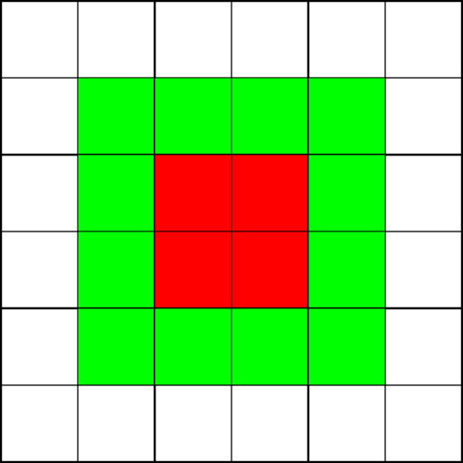

# Introduction to HartreeParticleDSL

## Legion & Regent
Legion is a task-based programming model and runtime system, primarily developed by researchers as Stanford University, SLAC, LANL and NVidia.

Regent is a DSL for Legion, embedded in Lua. It covers almost all of Legion’s functionality, while hiding much of the complexity that can appear when developing Legion C++ code, while enabling powerful metaprogramming to generate code directly.

### The Legion Programming Model
Legion’s programming model can be divided into 2 sections:
1. Computation model. Legion programs are divided into tasks, which are pieces of computation which operate on predefined data chunks. Tasks are required to have data privileges for each piece of data they take as inputs, and Legion supports read, write and reduction privileges for that data.
2. Data model. Legion uses an abstract data model that allows it to handle physical placement of data automatically. Data sections are called regions, and are constructed as the cross product of two spaces:
    * Index Space. An index space describes the size of the region, including dimensionality. For example, to have a one-dimensional array of size 10, the region would use an ispace(int1d, 10). For a 3-D array of size 10x10x5, the region would use an ispace(int3d, {10,10,5}).
    * Field Space. A field space describes the data available at each point in a region, and at a high level could be compared to a structure in C.
The resulting region is then similar to an array of structures in C, however the actual data layout is not defined as such.



As a program launches tasks, Legion computes the dependencies between the tasks, and launches tasks when their dependencies have been satisfied and their data is available. One advantage the Legion runtime has over traditional implementation is its ability to replicate data when it deems appropriate, which can enable parallelism that may have been unavailable in a traditional application.

In addition, Legion has a Mapper API, which allows expert users to specify callbacks used in the runtime to determine where tasks should be executed, or how data should be laid out for specific tasks.

To support parallel operations over regions, Legion has an expansive set of operators for creating partitions. A partition takes the index space of a region, and divides it into multiple sections. These sections can be complete or incomplete, disjoint or aliased, etc. so can be used to describe tiles, halo regions, or many other common HPC structures.

### Regent Programming Language
The Regent Programming Language is a Lua/Terra-based DSL for Legion, which allows higher-level, higher-productivity access to Legion functionality. One of the main attractions of Regent is the access to powerful metaprogramming.

Metaprogramming allows the construction of tasks at compile-time from some arbitrary code, akin to code-generation. HartreeParticleDSL makes heavy use of Metaprogramming to hide as much of the parallel code from the user.

## Particle Methods
Particle methods are used across a wide range of disciplines, as either standalone methods or paired with other methods, e.g.:
* Molecular Dynamics
* Dissipative Particle Dynamics
* Smoothed Particle Hydrodynamics
* Astrophysics (SPH, gravity + more)
* Particle In cell
These methods often share certain types of interactions:
* Pairwise interactions, i.e. interactions computed across all pairs of particles within a cutoff radius of each other.
* Per-particle operations, i.e. interactions computed for all particles in a system
As well as shared types of interactions, there are application specific interaction types:
* Bonded interactions
* Long-range interactions
* Non-constant cutoff radius interactions
Each of these types of interaction have a variety of algorithms that can be used to solve them depending on what architecture, problem size, etc. is being solved.

### Current Support
At the moment, HartreeParticleDSL only supports a limited subset of features required for particle methods:
1. Short-range pairwise interactions.
2. Per-particle operations.

#### Short-range pairwise interactions
The short-range pairwise interactions currently implemented use the cell-list algorithm. The basic idea for the algorithm is to divide the space into cells. Tasks then operate on cells, or pairs of cells, and loop through each cell to compute the n^2 interaction for the particles contained in these cells.

The high-performance implementation of this algorithm currently only supports asymmetric pairwise operations i.e. that for a pair of particles `p_1` and `p_2`, only updates to `p_1` are allowed. It is planned to expand this implementation to support symmetric pairwise operations in the future, there are just some algorithmic requirements about cell colouring that will be required to support this.

There are a variety of parameters that can be used to optimise the performance of tasks, as well as change the granularity of tasks. The primary control is the (average) number of particles in each cell.

#### Handling particle movement in Legion/Regent
In particle simulations, particles are usually not stationary, but instead move around the system. Since the initial partition is created based upon particle position it is important to handle this movement in some way. Unfortunately partitioning in Legion is a heavy, global operation so cannot be recomputed each time step to ensure the partition is up-to-date.

Instead, the implemented cell-pair algorithms makes use of a system called tradequeues (taken from https://github.com/stanfordhpccenter/soleil-x). Whenever the particle’s positions are updated, the tradequeue operation is automatically called by the runtime system. 

The tradequeues have two operations, `tradequeue_push` and `tradequeue_pull` applied. 
* `tradequeue_push` runs through the particles in a cell, and places all of the particles no longer belonging to that cell in the corresponding tradequeue.
* `tradequeue_pull` runs through a tradequeue and stores all of the particles in their new cell.
To make space for these particle exchanges, the tradequeue implementation also has some extra buffer space in each cell to avoid having to halt computation due to lack of space.

## Separation of Concerns
The two types of currently supported operations in HartreeParticleDSL operate on particles directly.
1. Per-particle operations operate on individual particles
2. Pairwise particles operate on pairs of particles that are within some cutoff radius.

### Particle type
The first separation of concerns is at the particle type definition. The particles are defined by the user as a field space in Regent. This field space has two sub-field spaces which are defined by the DSL:
1. Core particle field space. This contains particle data that is required by the system to be able to perform particle computations, such as positions and cutoff radius. These values can be modified freely by the user inside kernels.
2. Neighbour part space. This contains data specific to the neighbour search algorithms used. These values should not be modified by the user
On top of these two required fields, the particles can be freely defined by the user to contain whatever data is required for their simulation.

### Kernels
Kernels are defined in the system as Lua functions that return Regent statement quotes. This is required to be able to enable all the metaprogramming used in the DSL to generate the parallel code executed by the system.

To the user, other than some very small amount of boiler plate code, the kernels are just functions that take inputs appropriate to the type of kernel being solved, and the code required to compute their kernel on these inputs. For example for a pairwise kernel the user can write:
```
function my_pairwise_kernel( part1, part2, r2, config )
--boilerplate code
part1.thing = part2.thing2 * (r2 - config.min_distance)
end
```
This separation of concerns means that the user just has to specify whatever function they wish to solve independently of any decisions on what might be the best way to apply their function to the particles in the system.

These kernels can be executed by the user by calling the `invoke` function, and passing the kernel function as an argument, which causes the framework to generate the relevant code at compile time to run the kernel.


## Inner workings
Throughout this introduction we have discussed metaprogramming being used handle the code generation inside Regent. In this section we will highlight what actually happens inside the framework to be able to create this performance code.

### Invoke
The invoke function is the primary entry point for kernels, and is where the code generation begins. Each invoke call is passed any number of kernels of any types, where the order they exist in the parameter list defines the order in which the operations should take place (if there exist data dependencies between kernels).

The first job of the invoke function is to work out which kernels can be combined into the same tasks, and combine them if so. This is done by analysing the read, write and reduction elements of the kernel, and comparing them to the previous kernel(s) currently being stored. If no dependencies are detected, then kernels can be combined into the same task as they are known to be non-interfering. Only kernels of the same type can be combined.

Once this analysis is performed, the invoke function calls the neighbour search functions that create the optimised task code. These entirely depend on the chosen parameters of the simulation.

### Neighbour search implementations
The neighbour search implementations have one function for each kernel type they support. These functions return a Regent quote, containing all the code required to execute an input kernel (or combined kernel) across the system.

These functions analyse the kernel inputs, and create tables of data privileges (the Regent type), which are used to generate Regent tasks according to the neighbour search’s algorithms.


### Utility functions
On top of the functionality highlighted so far, there are a variety of utility functions inside HartreeParticleDSL that enable a variety of code analysis and code generation functionality. These are not expanded upon further in this introduction, but some are are discussed in the developer’s guide or common patterns sections of the documentation

## Current limitations
At the moment, HartreeParticleDSL is quite limited:
1. No high performance implementation of pairwise operations. This is still under development, and faces limitations of the current algorithms implemented in the system. This is being actively developed so we hope to improve this soon.
2. Limited feature set. As discussed in this introduction, HartreeParticleDSL does not yet support a lot of functionality required for many types of simulation. We’re constantly looking for ways to support new functionality – if there is a specific type of functionality that is important for a workflow you are working on please make a github issue and we’ll do our best to support that.

### Planned upcoming work
1. Improved pairwise performance implementation (issue #95)
2. Particle in Cell support. We plan to enable particle in cell support over the next few months.
3. Installation scripts and easier use (Issue #87). At the moment, there is no ability to just use HartreeParticleDSL from anywhere, but requires all execution to take place from its root directory. It should be relatively straightforward to expand this to have some install script/source script to setup environment variables to enable this to be executed from anywhere.

